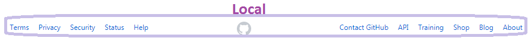

# Analizando elementos de navegación  

En este ejercicio tenemos que observar y eligir los elementos de navegacion de las siguientes paginas:  

 ## Breather:   

 Esta pagina web se basa en alquilar espacios ambientados por horas o días, dependiendo de la necesidad del cliente para entrevistas, cuarto de estudios, trabajos grupales, reuniones de trabajo, etc. A la vez se puede escoger el tiempo necesitado para rentarlo, indicar cuantas personas estarán presentes, y detalles extras que puedas requerir para tu reunión. Esta web es para el mercado Estadounidense, Europeo y Canadiense.
Ahora, veremos los elementos de navegación:  

- **Global** _(Menu Desplegable - Footer)_:  

Estos 2 ejemplos, nos muestra como podemos navegar por la pagina web ya que ambos muestran las mismas opciones estando en diferentes ubicaciones

- **Inline:**
Esta es un ejemplo inline:

 ya que hay un  enlace (subrayado) que al hacerle "CLICK" enlaza a una nueva pagína con un nuevo tipo de navegación:

- **Local:**
 
 En donde se puede hacer un nuevo tipo de navegación, la cual es _LOCAL_ ya que son busquedas internas

 - **Filtrado:**
 
 Es la parte principal de la pagina web ya que usa filtros para que el usuario pueda encontrar el espacio ambientado requerido:
 1.  Se usa para filtrar por país: Canada, EEUU, y Europa
 2.  Es usado para filtrar las horas o días en que el cliente desea el establecimiento
 3. 

 En esta tercera parte del filtrado, el cliente debe indicar cuantas personas estaran en el establecimiento para que dependiendo de eso, el sistema muestre diferentes tamaños de espacios.
 4. En esta ultima parte, muestra cosas extras que el usuario quisiera agregar, como por ejemplo:
  A. Espacio de parqueo, Televisión Plasma, Conexión Wifi, ascensores, etc.
  B. Indicar que tipo de reunión tendras como reunión de trabajo, terapia, sesión de fotos, etc.
  C.El costo por Hora o Día.
  

## Github:  

Es un repositorio remoto en donde programadores alrededor del mundo pueden subir sus trabajos (como función en nube). Los elementos de navegación son las siguientes:  

- **Global:**
Es la navegación principal de la pag. web.  

- **Local:**
Se puede navegar dentro de la pagina web con este buscador

- **Local II:** 
Se puede navegar dentro de la pagina web con este buscador ubicado en el footer.

- **Contextual:**
Recomienda los repositorios de otros usuarios basado en mi historial de repositorios vistos:  
  

## Medium:  

Esta pagina web se basa es articulos escritos y creados por los mismos usuarios sobre diversos temas (Ejemplo: culturales, de musica, opiniones, relaciones, economia, gobernamentales, etc,). Los Elementos de navegación en esta pagina son las siguientes:

- **Global:** 
Es la navegación principal de la pag. web.

- **Local:** Se puede navegar dentro de la pagina web con este buscador:

- **Contextual:** recomienda historias mas buscadas según mis historial de busqueda:

- **Contextual II:** recomienda las diferentes historias de un canal _en específico_ que he buscado anteriormente:

- **Facetado:** Me recomienda historias por default, no en basa de mis busquedas, sino por el mismo sistema:

- **Inline:** Se encuentra un enlace ingresado por el mismo usuario en su propio articulo para mejor entendimiento de ello:

>> Reto realizado por Franshesca Quezada
